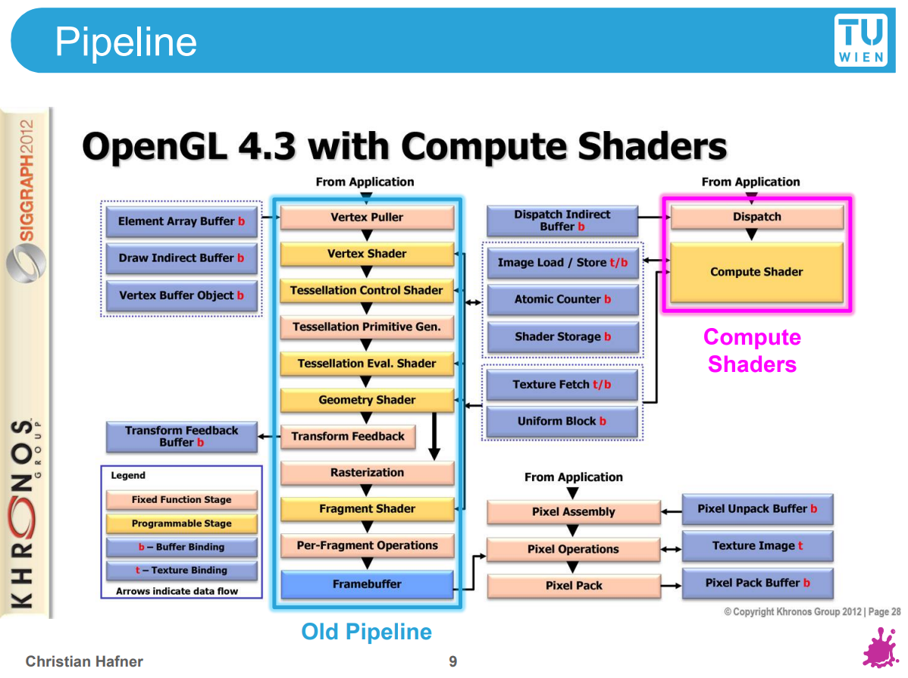
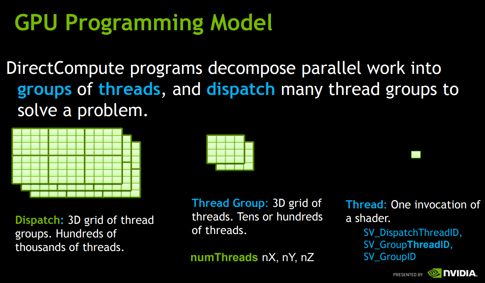
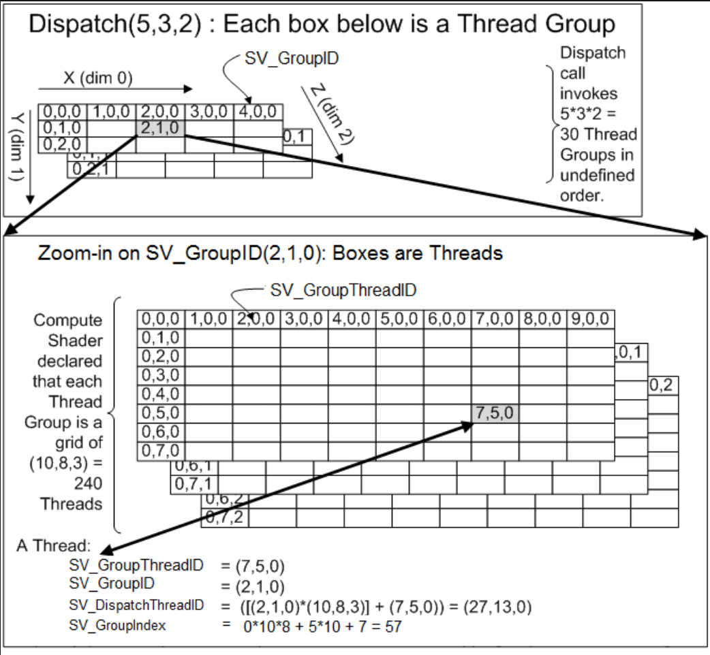
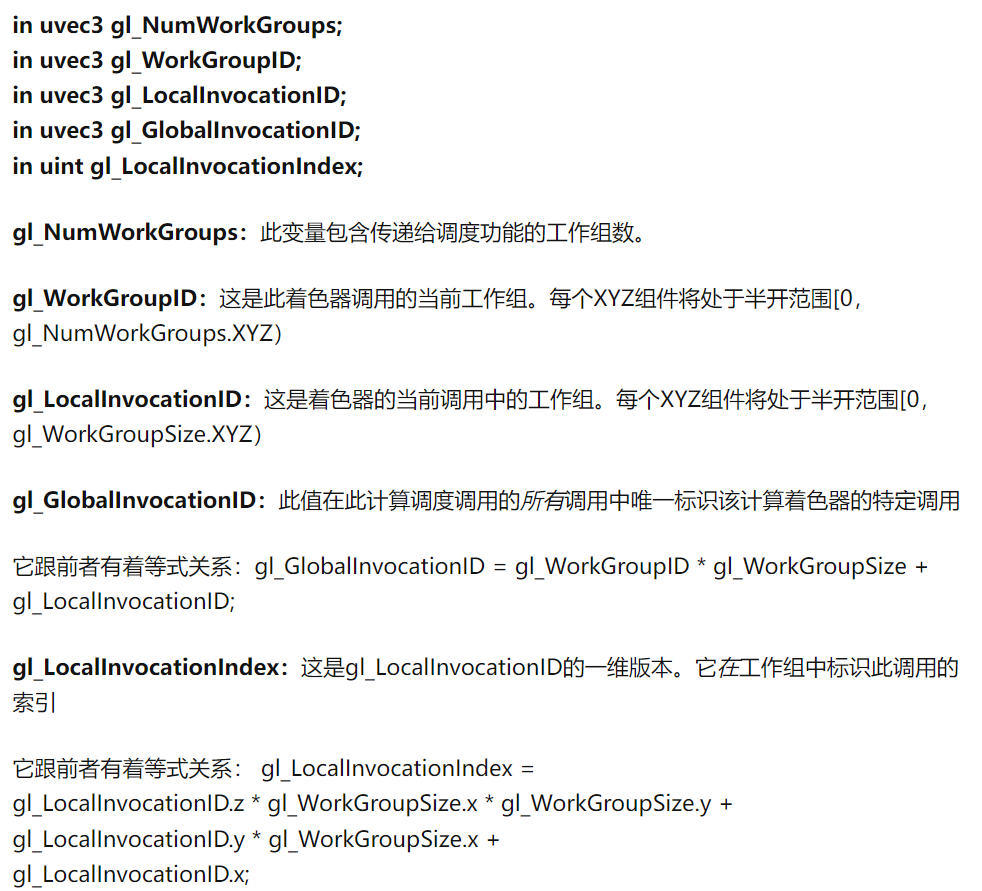
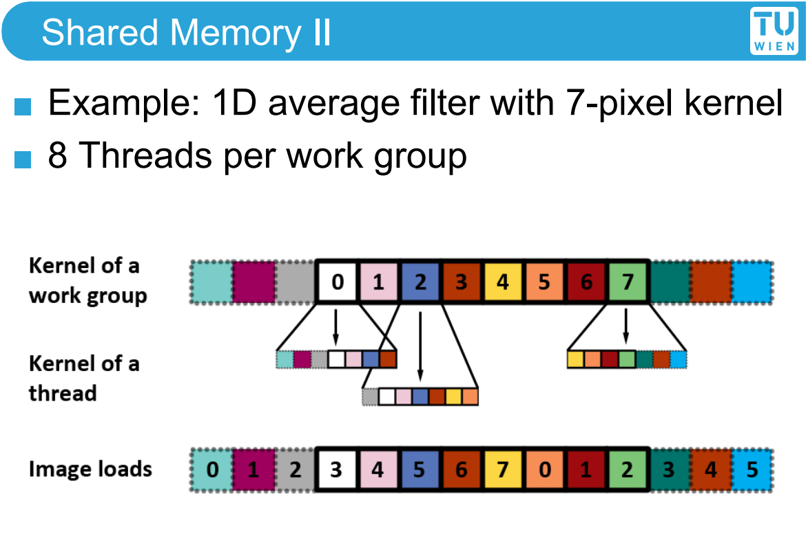

# ComputeShader

## Why

不同于传统的光栅化管线，ComputeShader的输入和输出都相当灵活，输入的Dispatch由程序员可以直接控制，输出可以直接访问和修改GPU中的Buffer，因此ComputeShader能够直接做大型并行的GPGPU算法。例如：GPU粒子模拟，物理模拟，在GPU-Driven Pipeline中承担剔除和准备渲染IndirectBuffer的角色，在GPU动画中计算骨骼位置等...

## What

#### ComputeShader的机制

ComputeShader的计算过程，被抽象为Dispatch-Thread Group-Thread

上图揭示了Dispatch-Thread Group-Thread的关系

#### CS的ThreadID

#### CS中的并行关系：

Threads in the same group run concurrently

Threads in different groups may run concurrently

#### CS中的GPU资源

按照访问权限划分

1. Local memory：CS中的声明使用的局部变量

2. Shared memory（也叫Thread Group Shared Memory）：Thread Group内共享，生命周期只在单次的Dispatch call

3. Global memory：Textures，buffers，etc

其中Shared memory是CS的优势所在：

1. Share it with other threads in SM：缓存一些复杂的计算结果；默认情况下使用RT缓存中间计算结果，通过多Pass最终完成计算，这会导致RT切换。Shared memory可以缓存一些中间的计算结果，支持在一个pass内完成计算，避免RT切换带来的带宽消耗。
2. Read data from global memory once：使用Shared memory缓存避免重复采样：比如在一些图像空间算法，Bloom，Blur需要采样周围的像素，使用PS来计算会不同像素间没有Shared memory而只能重复多次采样。

#### 

#### CS与传统管线并行

 IOS设备上完全并行，Mali设备上可以和Vertex Shader顺序执行，和Pixel Shader并行。可以减少输入输出的依赖，提高并行性。

#### CS有哪些不足？（这一块理解还不够）

1. 不支持FrameBuffer的压缩
2. 不具备纹理读取缓存的硬件优化：在ps中，采样当前uv对应的纹理会更快，因为会预先缓存
3. 纹理输出格式较少

//OpenGL下的输入

**in uvec3 gl_NumWorkGroups;**
**in uvec3 gl_WorkGroupID;**
**in uvec3 gl_LocalInvocationID;**
**in uvec3 gl_GlobalInvocationID;**
**in uint gl_LocalInvocationIndex;**

[Compute Shader : Optimize your game using compute - 知乎 (zhihu.com)](https://zhuanlan.zhihu.com/p/53785954)

[DirectX11 With Windows SDK--29 计算着色器：内存模型、线程同步；实现顺序无关透明度(OIT) - X_Jun - 博客园 (cnblogs.com)](https://www.cnblogs.com/X-Jun/p/12272328.html#_label1)

[Compute Shader介绍（一） - 知乎 (zhihu.com)](https://zhuanlan.zhihu.com/p/170615063)

[Compute Shader介绍（二） - 知乎 (zhihu.com)](https://zhuanlan.zhihu.com/p/177018035)